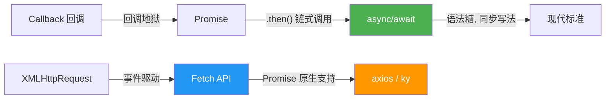

# Ajax 全栈实战：从 XMLHttpRequest 到 async/await，一文搞懂前端异步通信

> **专栏：** 每日一课  
> **阅读时长：** 7 分钟  
> **关键词：** Ajax · XMLHttpRequest · Fetch · Promise · async/await · Node.js · CORS · Event Loop

---

## 一、前言：Ajax 何以改变 Web？

在 Web 1.0 时代，用户与页面的每一次交互都意味着一次**完整的页面刷新**——点一个按钮，整个页面白屏、重载，用户体验非常割裂。2005 年，Jesse James Garrett 在一篇文章中正式提出 **Ajax（Asynchronous JavaScript And XML）** 这个概念，彻底改变了前端与服务器的通信方式。

Ajax 的核心思想很简单：**让 JavaScript 在页面不刷新的前提下，主动发起 HTTP 请求，拿到数据后动态更新 DOM。** 正是这个能力，催生了 Web 2.0 时代的繁荣——Gmail、Google Maps、微博瀑布流，背后都是同一套机制在驱动。

今天，我们以一个**极简但完整的 Todo 前后端分离项目**为蓝本，从零梳理 Ajax 全链路技术栈。项目结构如下：

```
ajax/
├── README.md          # 核心知识点笔记
├── backend/
│   └── index.js       # Node.js 原生 HTTP 服务端
└── frontend/
    └── index.html     # 前端页面（XHR + DOM 渲染）
```

> 麻雀虽小，五脏俱全。Let's dive in.

---

## 二、后端：Node.js 原生 HTTP 服务器

首先来看服务端 `backend/index.js`，这是一个用 Node.js 内置 `http` 模块搭建的极简 API 服务：

```js
const http = require('http')

http.createServer((req, res) => {
  const todos = [
    { id: 1, title: '过四六级', completed: false },
    { id: 2, title: '回家过节', completed: false }
  ]

  res.setHeader('Access-Control-Allow-Origin', '*')
  res.setHeader('Content-Type', 'application/json; charset=utf-8')

  if (req.url === '/') {
    res.end('hello world')
  }
  if (req.url === '/todos') {
    res.end(JSON.stringify(todos))
  }
}).listen(5000, () => {
  console.log('server is running at http://localhost:5000')
})
```

### 2.1 CommonJS 模块化

代码第一行 `require('http')` 使用的是 **CommonJS** 规范，这是 Node.js 早期的模块化方案。在 ES Module 成为标准之前，CommonJS 几乎是 Node.js 生态的基石。理解两者的演进关系，对于阅读老项目源码非常有帮助：

| 规范 | 导入 | 导出 |
|------|------|------|
| CommonJS | `require('module')` | `module.exports = ...` |
| ES Module | `import ... from 'module'` | `export default ...` |

### 2.2 JSON.stringify —— 对象的"网络形态"

`JSON.stringify(todos)` 这行代码看似简单，却是前后端通信的**核心环节**。它的作用是将 JavaScript 对象序列化为 JSON 字符串：

- **为什么要序列化？** 网络传输只能传递二进制/字符串，不能直接传递 JS 对象引用。
- **三个参数：** `JSON.stringify(value, replacer?, space?)`
  - `replacer`：过滤器，传 `null` 表示原样序列化；也可以传数组指定要保留的 key。
  - `space`：缩进空格数，用于提升可读性——团队协作中统一这个参数是很实用的规范。

与之对应，前端拿到 JSON 字符串后需要用 `JSON.parse()` 反序列化还原为 JS 对象。

### 2.3 CORS 跨域头

```js
res.setHeader('Access-Control-Allow-Origin', '*')
```

前后端分离开发时，前端页面（通常跑在 `localhost:5500` 或 `file://`）与后端接口（`localhost:5000`）属于**不同源**，浏览器会触发同源策略拦截。这行响应头就是告诉浏览器：**"我允许任意来源访问我"**。

> ⚠️ 生产环境中请将 `*` 替换为具体域名，避免安全风险。

---

## 三、前端：XMLHttpRequest —— Ajax 的"老炮儿"

前端代码 `frontend/index.html` 使用 **XMLHttpRequest（XHR）** 向后端发起请求：

```js
const xhr = new XMLHttpRequest()
xhr.open('GET', 'http://localhost:5000/todos', true)

xhr.onreadystatechange = function () {
  if (xhr.status === 200 && xhr.readyState === 4) {
    const todos = JSON.parse(xhr.responseText)
    Todos.innerHTML = todos.map(t => `<li>${t.title}</li>`).join('')
  }
}

xhr.send()
```

### 3.1 XHR 的生命周期

XHR 通过 `readyState` 属性暴露请求的当前状态，一共 **5 个阶段**：

| readyState | 含义 |
|------------|------|
| `0` | UNSENT —— 实例已创建，但 `open()` 尚未调用 |
| `1` | OPENED —— `open()` 已调用 |
| `2` | HEADERS_RECEIVED —— 收到响应头 |
| `3` | LOADING —— 正在接收响应体 |
| `4` | DONE —— 请求完成 |

只有在 `readyState === 4` 且 `status === 200` 时，才表示一次成功的 HTTP 请求拿到了完整的响应数据。

### 3.2 open() 的第三个参数：异步开关

```js
xhr.open('GET', url, true)  // true = 异步，false = 同步
```

第三个参数控制请求是异步还是同步：
- 传 `true`（默认）时，XHR **不会阻塞** JS 主线程，请求发出后代码继续往下走
- 传 `false` 时，`send()` 会**卡住整个页面**直到响应返回——这在现代前端开发中几乎已被废弃，因为它会冻结 UI

### 3.3 DOM 动态渲染

拿到数据后，我们用模板字符串拼接 HTML，再通过 `innerHTML` 一次性注入 DOM：

```js
Todos.innerHTML = todos.map(t => `<li>${t.title}</li>`).join('')
```

这就是 Ajax 最经典的范式：**请求数据 → 解析数据 → 更新 DOM**。Vue/React 等现代框架本质上也是在这个循环上做了声明式封装和虚拟 DOM 优化。

---

## 四、Fetch API —— XHR 的现代化继任者

代码中被注释掉的这段，展示了 XHR 的现代化替代方案：

```js
fetch('http://localhost:5000/todos')
  .then(res => res.json())
  .then(data => console.log(data))
  .catch(err => console.log(err))
```

### 4.1 Fetch vs XHR 对比

| 维度 | XMLHttpRequest | Fetch |
|------|---------------|-------|
| API 风格 | 事件驱动（`onreadystatechange`） | Promise 链式调用 |
| 语法简洁度 | 较繁琐 | 简洁直观 |
| 错误处理 | 仅网络层错误 | 需手动检查 `res.ok` |
| 请求/响应流 | 支持 `upload.progress` | 暂不支持原生上传进度 |
| 中断请求 | `xhr.abort()` | `AbortController` |
| 浏览器兼容性 | 全兼容 | IE 不支持 |

Fetch 基于 Promise，天然支持链式调用，代码可读性明显优于 XHR 的回调嵌套。但在需要上传进度监听或兼容 IE 的场景下，XHR 依然是不可替代的选择。

---

## 五、JavaScript 异步处理的三次进化

这是理解 Ajax 的**核心前置知识**，JS 异步编程经历了三次范式跃迁：

### 5.1 第一代：回调函数（Callback）

```js
xhr.onreadystatechange = function () { /* ... */ }
```

JavaScript 是**单线程**语言，遇到异步任务（如网络请求、定时器）时，并不会原地等待，而是将其放入 **Event Loop（事件循环）** 中暂存，继续执行后续同步代码。等到异步任务有了结果，Event Loop 再从中取出对应的回调函数执行。

回调函数是最朴素的异步处理方式，但缺陷也很明显——当多个异步任务存在依赖关系时，会形成臭名昭著的**回调地狱（Callback Hell）**：

```js
// 😈 回调地狱示意
getData(function(a) {
  getMoreData(a, function(b) {
    getEvenMoreData(b, function(c) {
      // 越套越深...
    })
  })
})
```

### 5.2 第二代：Promise + .then()

```js
fetch(url)
  .then(res => res.json())
  .then(data => { /* 处理数据 */ })
  .catch(err => { /* 统一错误处理 */ })
```

Promise 用**链式调用**替代回调嵌套，将"横向缩进"变成"纵向串联"，并通过 `.catch()` 实现统一的错误捕获，极大提升了代码的可维护性。

```js
// ✅ Promise 链式调用，清晰可读
fetchUsers()
  .then(users => fetchPosts(users[0].id))
  .then(posts => renderPosts(posts))
  .catch(err => console.error('某一步出错了:', err))
```

### 5.3 第三代：async/await（✅ 推荐）

```js
async function getTodos() {
  try {
    const res = await fetch('http://localhost:5000/todos')
    const data = await res.json()
    console.log(data)
  } catch (err) {
    console.error(err)
  }
}
```

`async/await` 是 Promise 的**语法糖**，它让异步代码看起来像同步代码一样直观：

- 执行逻辑一目了然，不需要跳来跳去读 `.then()` 链
- 错误处理可以直接用 `try...catch`，符合传统编程习惯
- 调试更友好，断点可以打在 `await` 语句上

> ✅ **最佳实践：在新项目中优先使用 async/await。**

---

## 六、执行顺序实验：理解 Event Loop

前端代码中有一处巧妙的设计——三处 `console.log` 的输出顺序：

```js
console.log('start')             // ① 同步代码，立即执行

xhr.open('GET', url, true)
xhr.onreadystatechange = ...     // ③ 异步回调，等请求完成才执行
xhr.send()

console.log('end')               // ② 同步代码，xhr.send() 后立即执行
```

实际输出：

```
start
end
（请求完成后...）
2 → 3 → 4   // readyState 的变化过程
```

这个实验直观地验证了：**异步回调不会阻塞同步代码的执行。** 理解这一点，就理解了 JS 单线程异步模型的核心。

---

## 七、实战延伸：用 async/await 重构项目

作为练习，我们可以将项目中的 XHR 调用用 `async/await + fetch` 改写一遍：

```js
document.getElementById('btn').addEventListener('click', async () => {
  try {
    const res = await fetch('http://localhost:5000/todos')
    if (!res.ok) throw new Error(`HTTP ${res.status}`)
    const todos = await res.json()
    document.getElementById('Todos').innerHTML =
      todos.map(t => `<li>${t.title}</li>`).join('')
  } catch (err) {
    console.error('请求失败：', err.message)
  }
})
```

对比原版 XHR 代码：
- 📉 行数减少近一半
- 📖 逻辑线更清晰
- 🛡️ 错误处理更健壮

这就是技术演进带来的实实在在的**工程收益**。

---

## 八、技术演进全景图



---

## 九、总结

回顾整个项目，我们用不到 100 行代码串联起了 **Ajax 全链路的核心知识点**：

| 技术点 | 要点 |
|--------|------|
| **Node.js HTTP 模块** | 搭建简易 RESTful 服务，理解服务端请求-响应模型 |
| **JSON 序列化/反序列化** | `JSON.stringify` 与 `JSON.parse` 是前后端数据交换的通用语言 |
| **CORS 跨域** | 前后端分离开发的必备配置 |
| **XMLHttpRequest** | Ajax 的经典实现，理解 `readyState` 生命周期和异步模式 |
| **Fetch API** | 基于 Promise 的现代化请求方案 |
| **JS 异步演进** | Callback → Promise → async/await，理解每一代的痛点与解决方案 |
| **Event Loop** | 理解单线程 JS 如何通过事件循环实现非阻塞异步 |

> 技术的演进从来不是空中楼阁。XHR 虽然古老，但它的设计思想——通过 `readyState` 暴露请求生命周期、通过事件回调解耦请求与响应——至今仍然影响着后续所有网络请求 API 的设计。理解它的底层原理，再去使用 Fetch、axios 等上层封装，你会发现自己不再是"调包侠"，而是真正理解每一行代码在做什么的**工程师**。

---

*本文以一个完整的 Todo 前后端分离项目为切入点，从 Node.js 原生 HTTP 服务搭建，到前端 XHR/Fetch 请求发起，再到 JSON 序列化、CORS 跨域、JS 异步演进三大范式（callback → Promise → async/await），手把手带你吃透 Ajax 全链路。*
